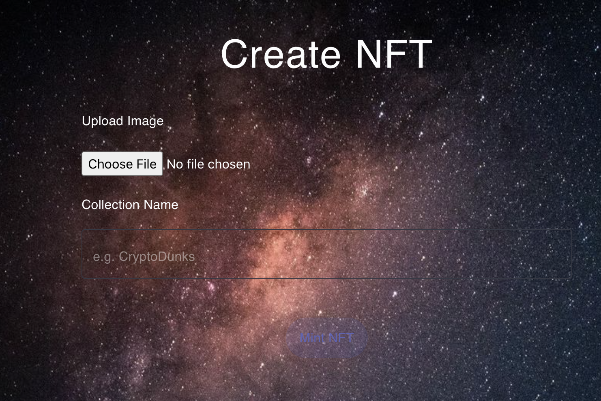

<!-- TABLE OF CONTENTS -->
# Table of Contents
- [Table of Contents](#table-of-contents)
- [OpenSea\_for\_NFT](#opensea_for_nft)
- [Built With(Technology Stack)](#built-withtechnology-stack)
- [Installation](#installation)
    - [Install and Run the Project](#install-and-run-the-project)
    - [Minter Else HTML](#minter-else-html)
    - [Creating NFT for Testing](#creating-nft-for-testing)
- [Uasge\&Instruction](#uasgeinstruction)
- [Contact](#contact)

# OpenSea_for_NFT

[](<https://github.com/Lijun56/OpenSea_for_NFT/blob/master/LICENSE>)


Welcome to the OpenSea_for_NFT project, an open-source platform designed to bring the functionality of the world's largest NFT marketplace, OpenSea, directly to your development environment. We believe in the power of non-fungible tokens (NFTs) to reshape the digital world, offering new ways to create, trade, and own digital assets. We also believe in the importance of open source software, which enables collective problem-solving and drives forward technological progress.

In this project, we marry these two passions: blockchain technology and open source collaboration. Our goal is to create a **decentralized** platform that is robust, efficient, user-friendly, and above all, transparent. With this project, we aim to empower developers to build their own NFT marketplaces, integrate NFT functionalities into their existing platforms, and join the exciting frontier of the NFT world.

**In this website, users are able to:** 

1. **Generate their own non-fungible token**
2. **Sell and buy other NFTs available in the market**

Whether you're an experienced blockchain developer or a newcomer to the field, we welcome your contributions and look forward to building the future of digital asset trading with you.


# Built With(Technology Stack)
This section should list any major frameworks/libraries used to bootstrap your project. Leave any add-ons/plugins for the acknowledgements section. Here are a few examples.

* [motoko][Next-url]
* [react.js][Next-url]
* [express.js][Next-url]
* [dfx][Next-url]

# Installation

_Below is an example of how you can instruct your audience on installing and setting up your app. This template doesn't rely on any external dependencies or services._

### Install and Run the Project
1. start local dfx

```
dfx start --clean
```

2. Run NPM server

```
npm start
```

3. Deploy canisters

```
dfx deploy --argument='("CryptoDunks #123", principal "3x2rt-opbez-2tupe-oilnc-a7nh4-onkus-kcbjn-35n4w-qvvgb-lab57-5qe", (vec {137; 80; 78; 71; 13; 10; 26; 10; 0; 0; 0; 13; 73; 72; 68; 82; 0; 0; 0; 10; 0; 0; 0; 10; 8; 6; 0; 0; 0; 141; 50; 207; 189; 0; 0; 0; 1; 115; 82; 71; 66; 0; 174; 206; 28; 233; 0; 0; 0; 68; 101; 88; 73; 102; 77; 77; 0; 42; 0; 0; 0; 8; 0; 1; 135; 105; 0; 4; 0; 0; 0; 1; 0; 0; 0; 26; 0; 0; 0; 0; 0; 3; 160; 1; 0; 3; 0; 0; 0; 1; 0; 1; 0; 0; 160; 2; 0; 4; 0; 0; 0; 1; 0; 0; 0; 10; 160; 3; 0; 4; 0; 0; 0; 1; 0; 0; 0; 10; 0; 0; 0; 0; 59; 120; 184; 245; 0; 0; 0; 113; 73; 68; 65; 84; 24; 25; 133; 143; 203; 13; 128; 48; 12; 67; 147; 94; 97; 30; 24; 0; 198; 134; 1; 96; 30; 56; 151; 56; 212; 85; 68; 17; 88; 106; 243; 241; 235; 39; 42; 183; 114; 137; 12; 106; 73; 236; 105; 98; 227; 152; 6; 193; 42; 114; 40; 214; 126; 50; 52; 8; 74; 183; 108; 158; 159; 243; 40; 253; 186; 75; 122; 131; 64; 0; 160; 192; 168; 109; 241; 47; 244; 154; 152; 112; 237; 159; 252; 105; 64; 95; 48; 61; 12; 3; 61; 167; 244; 38; 33; 43; 148; 96; 3; 71; 8; 102; 4; 43; 140; 164; 168; 250; 23; 219; 242; 38; 84; 91; 18; 112; 63; 0; 0; 0; 0; 73; 69; 78; 68; 174; 66; 96; 130;}))'
```

4. Head to localhost

http://localhost:8080/

### Minter Else HTML

```
 <div className="minter-container">
        <h3 className="Typography-root makeStyles-title-99 Typography-h3 form-Typography-gutterBottom">
          Minted!
        </h3>
        <div className="horizontal-center">
        </div>
      </div>

```


### Creating NFT for Testing

1. Mint an NFT on the command line to get NFT into mapOfNFTs:

```
dfx canister call opend mint '(vec {137; 80; 78; 71; 13; 10; 26; 10; 0; 0; 0; 13; 73; 72; 68; 82; 0; 0; 0; 10; 0; 0; 0; 10; 8; 6; 0; 0; 0; 141; 50; 207; 189; 0; 0; 0; 1; 115; 82; 71; 66; 0; 174; 206; 28; 233; 0; 0; 0; 68; 101; 88; 73; 102; 77; 77; 0; 42; 0; 0; 0; 8; 0; 1; 135; 105; 0; 4; 0; 0; 0; 1; 0; 0; 0; 26; 0; 0; 0; 0; 0; 3; 160; 1; 0; 3; 0; 0; 0; 1; 0; 1; 0; 0; 160; 2; 0; 4; 0; 0; 0; 1; 0; 0; 0; 10; 160; 3; 0; 4; 0; 0; 0; 1; 0; 0; 0; 10; 0; 0; 0; 0; 59; 120; 184; 245; 0; 0; 0; 113; 73; 68; 65; 84; 24; 25; 133; 143; 203; 13; 128; 48; 12; 67; 147; 94; 97; 30; 24; 0; 198; 134; 1; 96; 30; 56; 151; 56; 212; 85; 68; 17; 88; 106; 243; 241; 235; 39; 42; 183; 114; 137; 12; 106; 73; 236; 105; 98; 227; 152; 6; 193; 42; 114; 40; 214; 126; 50; 52; 8; 74; 183; 108; 158; 159; 243; 40; 253; 186; 75; 122; 131; 64; 0; 160; 192; 168; 109; 241; 47; 244; 154; 152; 112; 237; 159; 252; 105; 64; 95; 48; 61; 12; 3; 61; 167; 244; 38; 33; 43; 148; 96; 3; 71; 8; 102; 4; 43; 140; 164; 168; 250; 23; 219; 242; 38; 84; 91; 18; 112; 63; 0; 0; 0; 0; 73; 69; 78; 68; 174; 66; 96; 130;}, "CryptoDunks #123")'
```

2. List the item into mapOfListings:

```
dfx canister call opend listItem '(principal "si2b5-pyaaa-aaaaa-aaaja-cai", 2)'
```

3. Get OpenD canister ID:

```
dfx canister id opend
```

4. Transfer NFT to OpenD:

```
dfx canister call si2b5-pyaaa-aaaaa-aaaja-cai transferOwnerShip '(principal "ryjl3-tyaaa-aaaaa-aaaba-cai", true)'
```


<!-- USAGE EXAMPLES -->
# Uasge&Instruction

Use this space to show useful examples of how a project can be used. Additional screenshots, code examples and demos work well in this space. You may also link to more resources.

_For more examples, please refer to the [Documentation](https://example.com)_


<!-- CONTACT -->
# Contact

Bilibili - [@AdultCarrot](https://space.bilibili.com/621731855?spm_id_from=333.788.0.0)

Hashnode - [@LijunZhu](https://lijun.hashnode.dev/)

